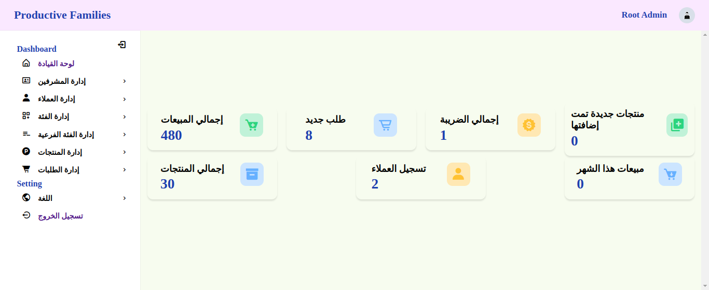
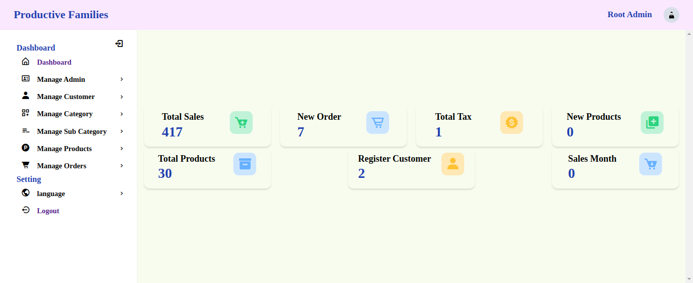
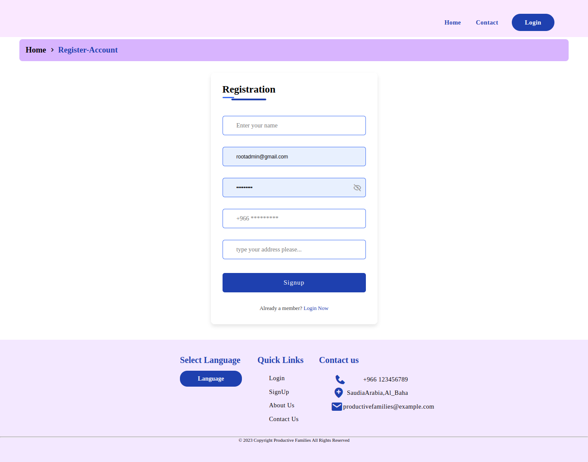
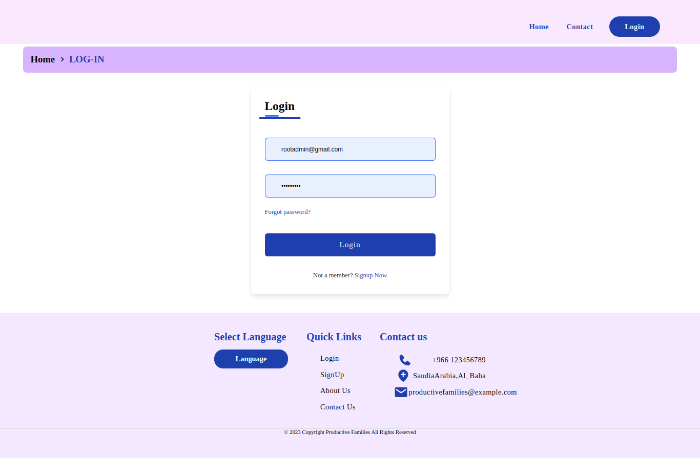
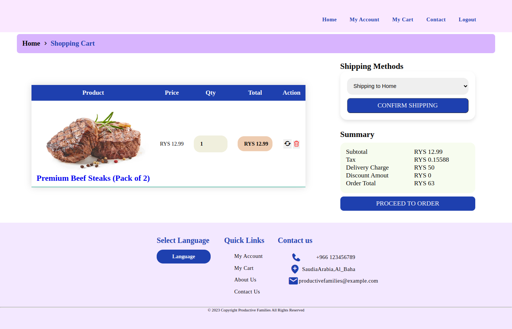
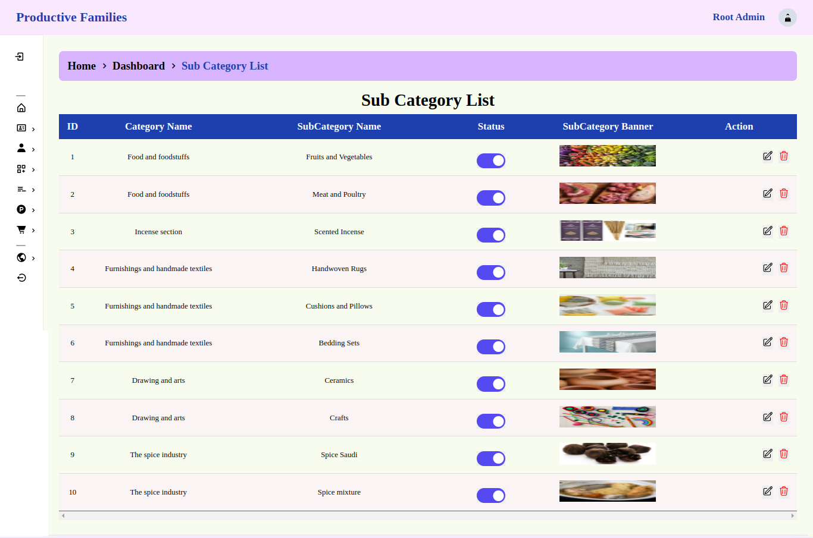

# promarket
ProMarket is a comprehensive online platform tailored specifically for professionals and craftsmen seeking to showcase and sell their products to a global audience. 

## Features

- **Product Publishing:** Artisans can easily publish their products with detailed descriptions and images, allowing them to showcase their craftsmanship effectively.
  
- **User Authentication:** Secure user authentication system ensures that only registered users can access seller features and perform transactions.

- **Shopping Cart:** Buyers can add products to their cart for convenient shopping and checkout.

- **Order Management:** Sellers can manage their orders, view order details, and update order statuses to keep buyers informed.

- **Search Functionality:** Users can search for products based on keywords, categories, or specific criteria to find exactly what they're looking for.

- **Messaging System:** Built-in messaging system facilitates communication between buyers and sellers for inquiries, customization requests, and order updates.

- **Feedback and Reviews:** Buyers can leave feedback and reviews for products they've purchased, providing valuable insights for both sellers and potential buyers.

- **Language Support:** ProMarket supports both English and Arabic languages, making it accessible and user-friendly for a wider audience.

## Technologies Used

- **Frontend:**
  - HTML
  - CSS
  - JavaScript

- **Backend:**
  - PHP
  - MySQL

## Setup

1. **Clone the Repository:**
   ```
   git clone https://github.com/your-username/promarket.git
   ```

2. **Import Database:**
   - Create a MySQL database named `promarketDB`.
   - Import the provided SQL file `DB/promarket.sql` to set up the necessary tables and data.

3. **Run the Application:**
   - Start your local server (e.g., using XAMPP, WAMP, or similar).
   - Access the application through your web browser by navigating to `localhost/promarket` for the main site or `localhost/promarket/admin` to access the admin panel.

#### Default User Information:
- The default user information for accessing the application, including admin credentials, can be found in the `DB/information.txt` file. Ensure to review and update these credentials as necessary to maintain security.

## Screenshots







... more in Folder  `Screenshot`

## Contributing

Contributions are welcome! Please feel free to submit a pull request.

## License

This project is licensed under the [GNU General Public License v3.0](LICENSE).
